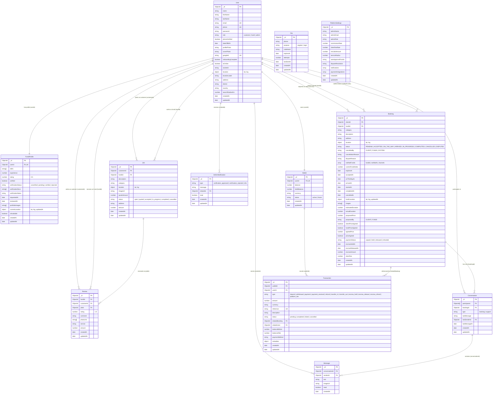
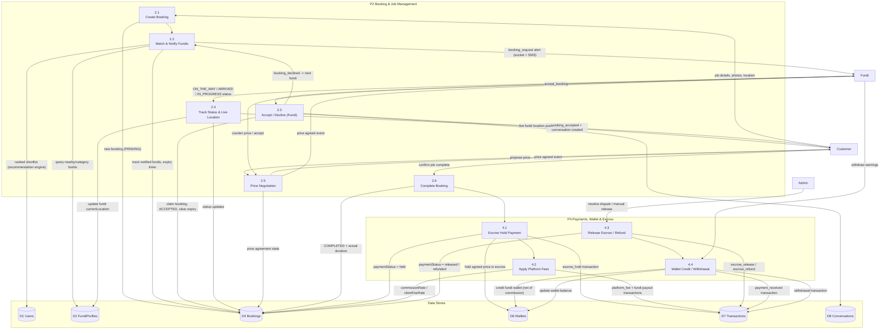
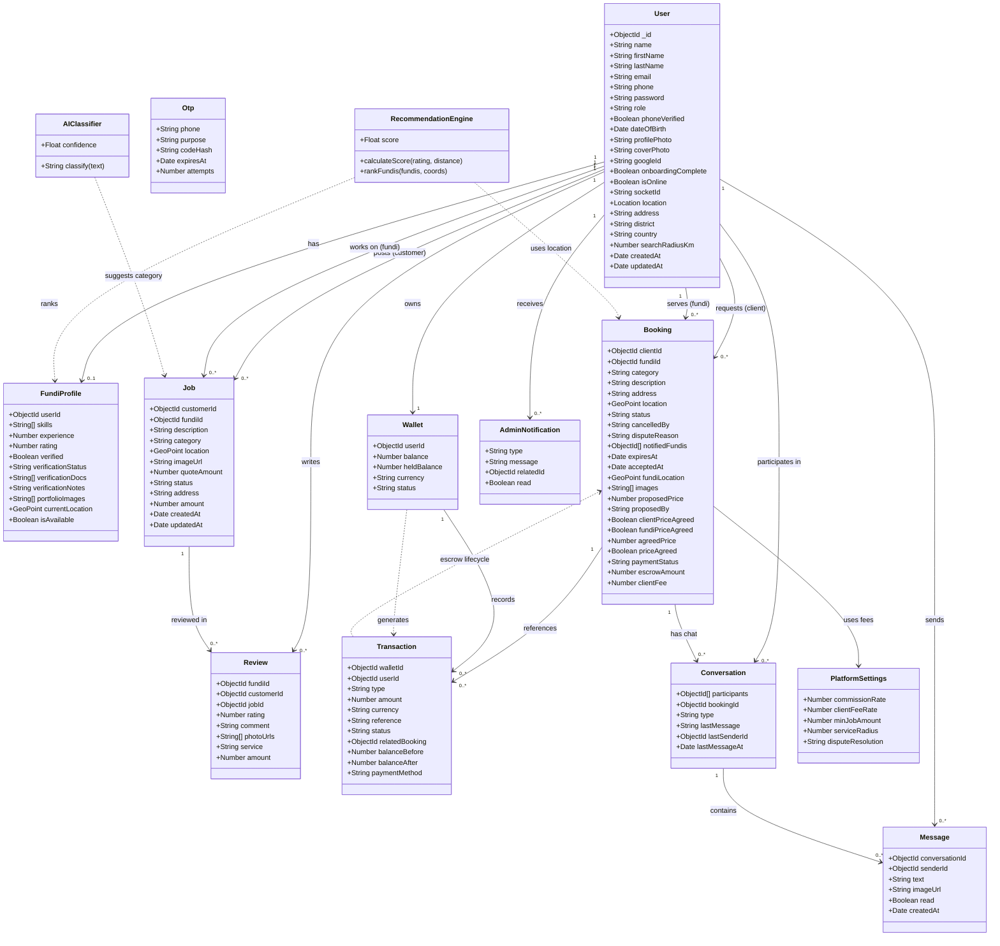

# FundiLink — Architecture Diagrams

Mermaid diagrams for the FundiLink system (Node.js/Express + MongoDB backend, React Native mobile app, React web admin).

## 1. Entity-Relationship (ER) Diagram



## 2. Context Diagram (DFD Level 0)

```mermaid
le App + Web Admin + Backend API)"]
    end
flowchart LR
    subgraph SYSTEM["FundiLink System"]
        S["FundiLink Platform<br/>(Mobi
    C["Customer / Client<br/>(Mobile App)"]
    F["Fundi / Artisan<br/>(Mobile App)"]
    A["Admin<br/>(Web Dashboard)"]

    C -->|"register/login (email, OTP)"| S
    C -->|"request job / create booking, negotiate price"| S
    C -->|"upload problem photos, review & rate fundi"| S
    C -->|"make payment, chat, live location requests"| S
    S -->|"fundi matches, booking status, live tracking"| C
    S -->|"OTP SMS, booking alerts, price agreement"| C

    F -->|"login, accept/decline booking, submit quote"| S
    F -->|"update status, live location, price negotiation"| S
    F -->|"chat, withdraw wallet earnings"| S
    S -->|"new job request alerts, booking details"| F
    S -->|"SMS notifications, payment released to wallet"| F

    A -->|"manage users, verify fundis, resolve disputes"| S
    A -->|"configure pricing/settings, release escrow"| S
    S -->|"analytics, reports, admin notifications"| A

    GM["Google Maps Geocoding API"]
    S -->|"geocode / reverse-geocode / route"| GM
    GM -->|"coordinates, addresses, ETA"| S

    SMS["EgoSMS Gateway"]
    S -->|"send OTP & notifications"| SMS
    SMS -->|"SMS delivery status"| S

    GROQ["Groq AI API"]
    S -->|"generate SMS copy for events"| GROQ
    GROQ -->|"AI-generated message"| S

    GOOGLE["Google Sign-In (OAuth)"]
    S -->|"social login token"| GOOGLE
    GOOGLE -->|"identity verification"| S

    DB[("MongoDB Database")]
    S <-->|"persist & read data"| DB
```

## 3. Level 1 DFD

```mermaid
flowchart TB
    subgraph P0["FundiLink System"]
        P1["P1<br/>Authentication &<br/>OTP Verification"]
        P2["P2<br/>Booking & Job<br/>Management"]
        P3["P3<br/>Fundi Matching &<br/>Recommendation Engine"]
        P4["P4<br/>Payments, Wallet &<br/>Escrow"]
        P5["P5<br/>Chat & Real-time<br/>Notifications"]
        P6["P6<br/>Reviews &<br/>Ratings"]
        P7["P7<br/>AI Assistant<br/>(Problem Classifier)"]
        P8["P8<br/>Maps &<br/>Location Services"]
        P9["P9<br/>Admin<br/>Management"]
    end

    subgraph DSTORE["Data Stores"]
        D1[("D1 Users")]
        D2[("D2 FundiProfiles")]
        D3[("D3 Jobs")]
        D4[("D4 Bookings")]
        D5[("D5 Otps")]
        D6[("D6 Wallets")]
        D7[("D7 Transactions")]
        D8[("D8 Conversations / Messages")]
        D9[("D9 Reviews")]
        D10[("D10 AdminNotifications")]
        D11[("D11 PlatformSettings")]
    end

    C["Customer"]
    F["Fundi"]
    A["Admin"]

    C -->|"credentials / OTP"| P1
    P1 -->|"verify & issue JWT"| C
    P1 <--> D5
    P1 <--> D1

    C -->|"create job/booking, price, cancel, complete"| P2
    P2 -->|"booking status & details"| C
    F -->|"accept/decline, update status, quote"| P2
    P2 -->|"job request alerts"| F
    P2 <--> D3
    P2 <--> D4

    P2 -->|"new booking + location"| P3
    P3 -->|"ranked fundi shortlist"| P2
    P3 <--> D2
    P3 <--> D1

    C -->|"deposit, pay booking"| P4
    P4 -->|"payment confirmation"| C
    F -->|"withdraw earnings"| P4
    P4 -->|"balance & payouts"| F
    A -->|"release escrow / refund"| P4
    P4 <--> D6
    P4 <--> D7
    P4 <--> D4

    C -->|"send message"| P5
    F -->|"send message / live location"| P5
    P5 -->|"real-time messages, booking alerts, live tracking"| C
    P5 -->|"booking requests, alerts, live tracking"| F
    P5 <--> D8
    P5 <--> D4
    P5 <--> D1

    C -->|"submit rating & review"| P6
    P6 -->|"rating feedback"| C
    P6 <--> D9
    P6 <--> D3

    C -->|"describe problem in natural language"| P7
    P7 -->|"category + confidence"| C
    P7 <--> D1

    C -->|"address / coordinates"| P8
    F -->|"live coordinates"| P8
    P8 -->|"geocoded location, ETA, nearby fundis"| C
    P8 <--> D2
    P8 <--> D4

    A -->|"manage users, verify fundis, resolve disputes, settings"| P9
    P9 -->|"reports, analytics, notifications"| A
    P9 <--> D1
    P9 <--> D2
    P9 <--> D4
    P9 <--> D10
    P9 <--> D11
    P9 <--> D7
```



## 4. Level 2 DFD — Booking & Payment Lifecycle (expansion of P2 + P4)



## 5. UML Class Diagram


